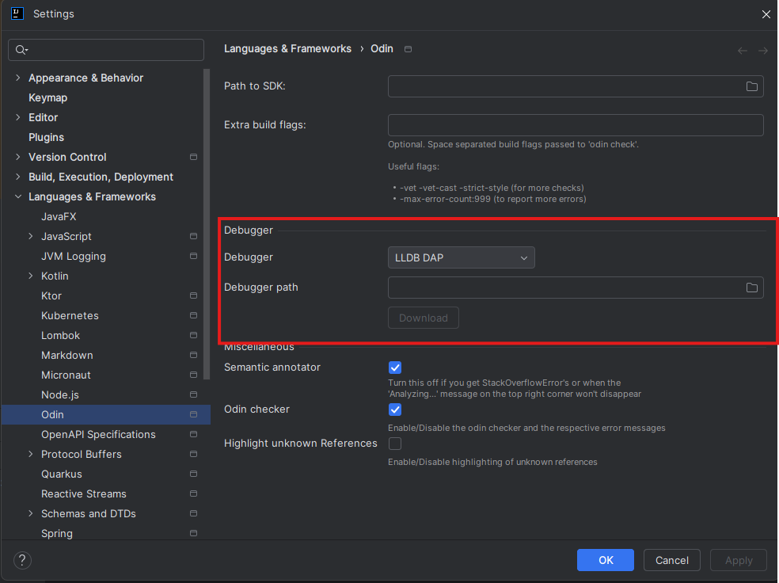
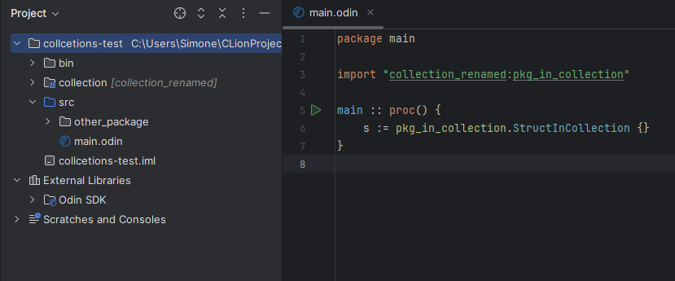
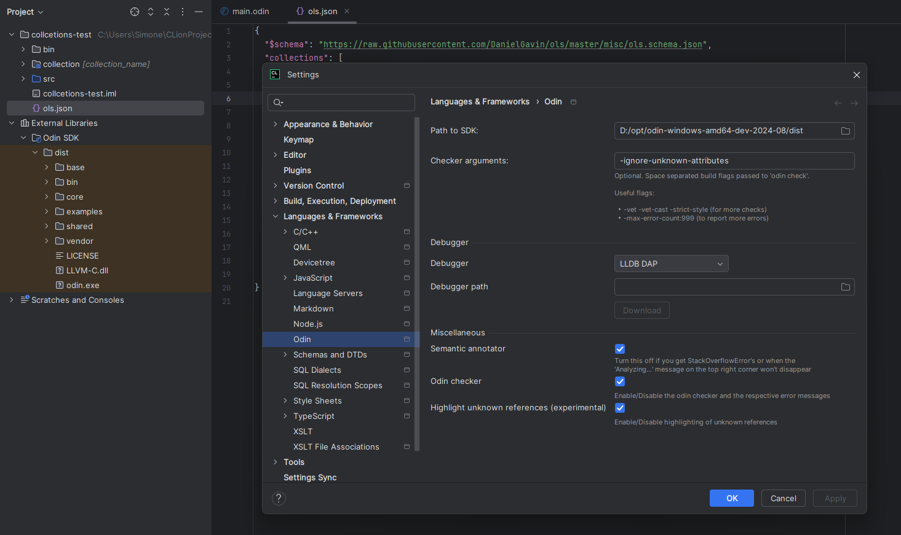

# Odin Support for IntelliJ

This plugin provides support for the [Odin programming language](https://www.odin-lang.org) in IntelliJ IDEA. You can add the plugin to your JetBrains IDE via the "Plugin" settings panel or by visiting the [Odin Plugin Page](https://plugins.jetbrains.com/plugin/22933-odin-lang-support).

## Getting Started

To begin, ensure you have installed the plugin using the steps mentioned above.

## SDK Setup

Download the Odin SDK [here](https://github.com/odin-lang/Odin/releases) or build it from source by following the instructions on the same [page](https://github.com/odin-lang/Odin/releases).

### Creating a New Project

Use the "New Project..." wizard in IntelliJ to create a blank Odin project. The default project structure will look like this:

```
| - bin
| - src
| -- main.odin
```

### Importing a Project from Existing Sources

If you are importing an existing Odin project, refer to the **Advanced Settings** section below for additional configuration steps.

### Project Settings

To configure the project:

1. Open the settings panel and navigate to **Languages & Frameworks** > **Odin**.
2. Set the following fields:
  - **Path to SDK**: The location of the Odin SDK folder, where the Odin binary resides.
  - **Checker Arguments**: Command-line arguments for the Odin checker. These arguments control the warnings and errors displayed in the editor. Run `odin checker --help` for a list of available options.

### Debugger Settings

Debugger support is available in IntelliJ IDEA Ultimate, GoLand, CLion, PyCharm Professional, and RustRover. If you don't see the **Debugger Settings** section in the Odin settings, you need to install the [Native Debugging Support plugin](https://plugins.jetbrains.com/plugin/12775-native-debugging-support) from the JetBrains marketplace.

Here’s an example of what the settings panel will look like when properly configured:



The following sections outline the setup for various debuggers.

#### LLDB-DAP

To set up LLDB-DAP:

1. Download the LLVM 18.1.x binaries for your platform.
2. In the Odin settings page, select the `lldb-dap` executable from the `bin` directory.

> **Important:**  
> LLDB-DAP requires Python 3.10. Ensure Python 3.10 is installed and accessible by LLDB-DAP. On Windows, the easiest approach is to download the embeddable Python 3.10 package and extract its contents into the LLVM `bin` directory.

#### Windows Debugger

To set up the Windows debugger, click the **Download** button. Once the download completes, the path to the debugger will be configured automatically.

#### LLDB (Linux and macOS Only)

On Linux and macOS, LLDB works out-of-the-box without additional configuration.

## Advanced Settings

To unlock the full feature set of this plugin, you must configure **Source Directories** (mandatory) and **Collection Directories** (optional).

### Source Directories

Source directories define the root of your project's source code. These settings are essential for code auto-completion and other IDE features. To mark a directory as a source root:

1. Right-click the directory in the project view.
2. Select **Mark Directory as > Odin Sources Root**.


This directory should contain your Odin file with the `main` procedure and your package structure. You can have multiple source roots, but one source root must not be a subdirectory of another.

### Collection Directories

Odin supports custom collections, which are comparable to library dependencies. To use packages within custom collections, you must mark the directory as a **Collection Source Root**.


After marking a directory as a Collection Source Root, you can reference the packages it contains using the collection’s name.

In the screenshot above, the collection name is the same as the directory name. However, you can rename the collection via the **Rename Refactoring** option, and the corresponding references in your code will update automatically.


In the project view, the collection name will appear next to the directory:



### Import Settings from `ols.json`

If you have previously used [ols](https://github.com/DanielGavin/ols), you might have an `ols.json` file containing your LSP settings. You can import a subset of these settings into your IntelliJ project by:

1. Right-clicking the `ols.json` file.
2. Selecting **Import OLS Config**.

Example:


After the import, settings like **checker arguments** (`checker_args`), **checker paths** (`checker_paths`), and **collections** will be applied to your IntelliJ project.



## Resources

### Odin Language

Odin is under continuous development. Stay updated with the latest news and features on the [Odin Website](https://www.odin-lang.org).

### Grammar

While creating the BNF rules for Odin, inspiration was drawn from the Go programming language.

- Go Language Resources:
  - [Grammar-Kit Grammar for Go](https://github.com/go-lang-plugin-org/go-lang-idea-plugin/blob/master/grammars/go.bnf)
  - [ANTLR4 Grammar for Go](https://github.com/antlr/grammars-v4/blob/master/golang/)

For more details on using JetBrain's Grammar-Kit to create custom language plugins, refer to the official [Grammar-Kit documentation](https://github.com/JetBrains/Grammar-Kit/blob/master/HOWTO.md).

## Important Note

This plugin is _not_ an official Odin project. It is neither affiliated with nor endorsed by the Odin team. If you encounter issues with this plugin, please report them using the GitHub issue tracker for this repository, and not to the Odin team directly.
